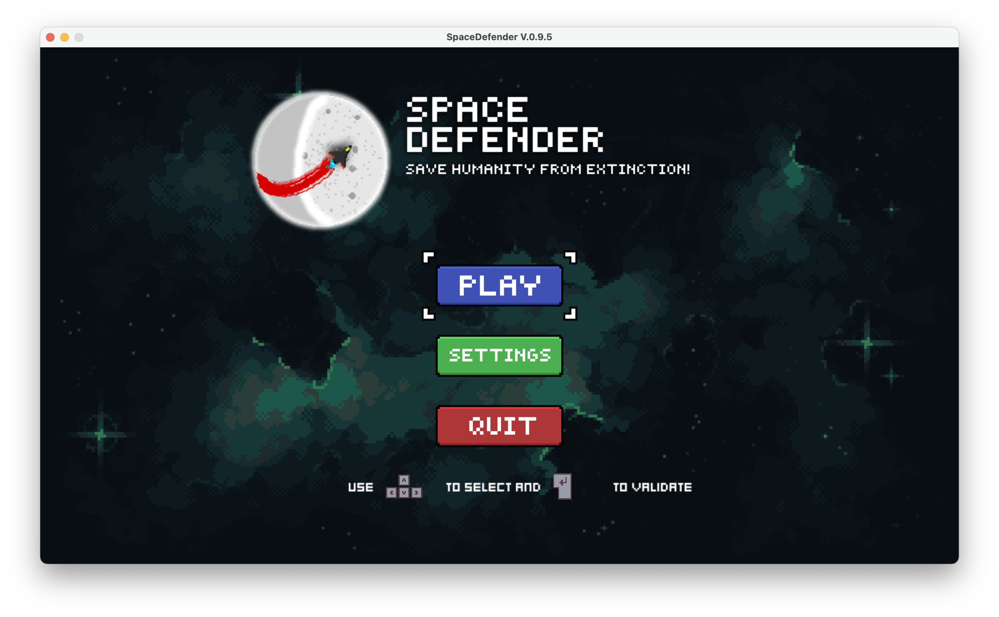
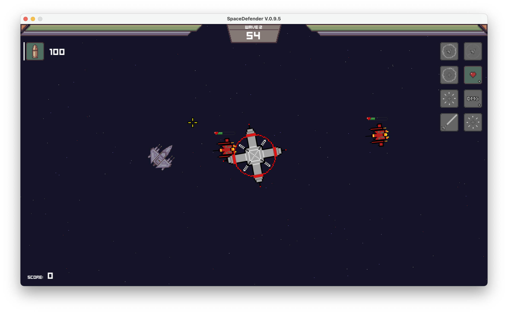

# Space Defender
### A python game
A python space invaders type game made as a school project with the Arcade Python Library.
**Title Page**

**Game Interface

Game spawns enemis at random intervals with hp bars that grow faster over time. Player damage and resistance grows over time as well. At each stage the player unlocks different power ups such as:
> Hunting Missiles
> Player Shield
> Home Base Shield
> Home Base Self Defense System
> Enemy Lockdown system (Like a VALORANT Killjoy Ult)
> Bouncing Laser that targets 
> 